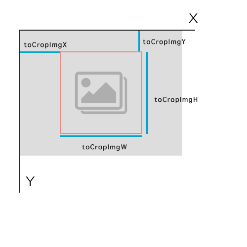

## Vue-Core-Image-Upload  中文文档

[English Doc]('./README.md')

一款轻量级的vue上传插件 ( 支持 📱 IE9+)

如果你使用 vue.js(<=2.0), 你可以到这里克隆代码 [here](https://github.com/Vanthink-UED/vue-core-image-upload/tree/v1.x).或者在安装的时候使用
1.x.x 版本.


### Install

``` bash
npm i vue-core-image-upload --save
```

使用ES6
``` js
import VueCoreImageUpload  from 'vue.core.image.upload';

new Vue({
  el: '#app',
  components: {
    'vue-core-image-upload': VueCoreImageUpload
  },
  data: {
    src: 'http://img1.vued.vanthink.cn/vued0a233185b6027244f9d43e653227439a.png',
  },
  methods: {
     imageuploaded(res) {
      if (res.errcode == 0) {
        this.src = 'http://img1.vued.vanthink.cn/vued751d13a9cb5376b89cb6719e86f591f3.png';
      }
    }
  }
});
```

使用ES5
```js

// include the script ./node_modules/vue-core-image-upload/index.js
<script src="http://s1.vued.vanthink.cn/3e3f5b16269d/vue-core-image-upload.js"></script>
...
<script>
    var MyComponent = Vue.extend(VueCoreImageUpload);
    new Vue({
      el: '#app',
      components: {
        'vue-core-image-upload': MyComponent
      },
      data: {
        src: 'http://img1.vued.vanthink.cn/vued0a233185b6027244f9d43e653227439a.png',
      },
      methods: {
        imageuploaded: function(res) {
          if (res.errcode == 0) {
            this.src = 'http://img1.vued.vanthink.cn/vued751d13a9cb5376b89cb6719e86f591f3.png';
          }
        }

      }
</script>
```

``` html
<vue-core-image-upload v-bind:class="['pure-button','pure-button-primary','js-btn-crop']" v-bind:crop="false" url="./crop.php" extensions="png,gif,jpeg,jpg"></vue-core-image-upload>
```

[Demo] (http://vanthink-ued.github.io/vue-core-image-upload/upload.html)

### 配置属性

| Props        | Type         | Example  | Description  |
| ------------- |:----------| ---------|--------------|
| url     | String | '/crop.php' | 服务端上传的地址 |
| text      | String      |  'Upload Image' | 你需要显示按钮的文本|
| inputOfFile | String     |   'file' | 上传服务端对应表单 name |
| extensions | String   |    'png,jpg,gif' | 限制的图片类型 |
| crop | Boolean   |   true | 是否需要裁剪 |
| cropRatio | String   |   '1:1' | 限制裁剪的形状|
| cropBtn | Object   |   {ok:'Save','cancel':'Give Up'} | 按钮文本|
| maxFileSize | Number   |   10485760(10M) | 文件大小限制|
| maxWidth | Number   |   150 | 限制图片的最大宽度|
| maxheight | Number   |   150 | 限制图片的最大高度|
| inputAccept | string   |  'image/*' / 'image/jpg,image/jpeg,image/png' |  赋予上传file的接受类型  |
| isXhr | Boolean  | true  |  是否需要调用系统内自己的上传功能
| headers | Object  | {auth: xxxxx}  |  设置xhr上传 的header

### 支持的事件类型

``` js
//finish image uload
imageuploaded(res) {
  if (res.errcode == 0) {
    this.src = 'http://img1.vued.vanthink.cn/vued751d13a9cb5376b89cb6719e86f591f3.png';

  }
}
// return file object
imagechanged(res) {
  console.log(res.name)
}


// uploading image
imageuploading(res) {
  console.info('uploading');
}

// handle some error like ajax not working
errorhandle(err) {
  console.error(err);
}
```

### 发给服务端的裁剪参数

                        


参数如上图。

如果你需要自定义裁剪弹窗的的样式，你可以自己写css进行覆盖
